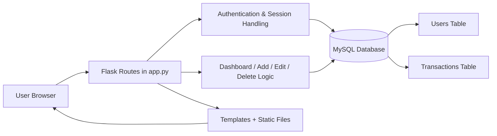

# Expense Tracker

A simple personal expense management web application built with Flask, MySQL, and HTML/CSS/JavaScript. The app allows users to register, log in, track income and expenses, and view total balances on a dashboard.

## Project Overview

This project follows a classic client-server architecture:

- Frontend: HTML templates and static assets rendered by Flask
- Backend: Flask application logic in `app.py`
- Database: MySQL for persistent user and transaction data
- Auth: Session-based login using Flask sessions and password hashing

## End-to-End Architecture



### Request Flow

1. A user opens the app in the browser.
2. Flask serves pages from the templates folder and static assets from the static folder.
3. The user registers or logs in through routes like `/register` and `/login`.
4. The backend validates form input and hashes passwords before saving them to the `users` table.
5. After login, a session is created and the user is redirected to the dashboard.
6. The dashboard fetches transactions for that authenticated user from the `transactions` table.
7. The app calculates total income, total expenses, and remaining balance.
8. Users can add, edit, and delete transactions, and each action updates the database.

## Tech Stack

- Python 3.x
- Flask
- MySQL Connector for Python
- MySQL Database
- Jinja2 Templates
- HTML/CSS/JavaScript

## Project Structure

- `app.py` — main Flask application and route definitions
- `database.py` — MySQL database connection setup
- `templates/` — HTML pages for login, register, dashboard, add, and edit flows
- `static/` — CSS and JavaScript files
- `requirements.txt` — Python dependencies
- `README.md` — project documentation

## Required Setup Steps

### 1. Clone the project

```bash
git clone <repository-url>
cd expense_tracker
```

### 2. Create and activate a virtual environment

On Windows:

```powershell
python -m venv venv
.\venv\Scripts\Activate.ps1
```

On macOS/Linux:

```bash
python3 -m venv venv
source venv/bin/activate
```

### 3. Install dependencies

```bash
pip install -r requirements.txt
```

### 4. Set up MySQL database

Create a MySQL database and user (or use an existing one):

```sql
CREATE DATABASE expense_tracker;
```

Then create the required tables:

```sql
USE expense_tracker;

CREATE TABLE users (
    id INT AUTO_INCREMENT PRIMARY KEY,
    name VARCHAR(100) NOT NULL,
    email VARCHAR(150) NOT NULL UNIQUE,
    password VARCHAR(255) NOT NULL
);

CREATE TABLE transactions (
    id INT AUTO_INCREMENT PRIMARY KEY,
    user_id INT NOT NULL,
    type VARCHAR(20) NOT NULL,
    category VARCHAR(100) NOT NULL,
    amount DECIMAL(10,2) NOT NULL,
    description TEXT,
    transaction_date DATE NOT NULL,
    FOREIGN KEY (user_id) REFERENCES users(id)
);
```

### 5. Configure environment variables

The app reads these values from environment variables:

```bash
DB_HOST=localhost
DB_USER=root
DB_PASSWORD=your_mysql_password
DB_NAME=expense_tracker
DB_PORT=3306
```

You can set them in your terminal before running the app, or configure them in your hosting environment if deploying.

### 6. Run the application

```bash
python app.py
```

Then open:

```text
http://127.0.0.1:5000
```

## Default App Behavior

- Users can register with a name, email, and password.
- Passwords are hashed before being stored.
- Logged-in users are redirected to the dashboard.
- The dashboard shows:
  - recent transactions
  - total income
  - total expenses
  - current balance
- Transactions can be created, edited, and deleted.

## Production Notes

- Use a strong secret key instead of the default static Flask secret.
- Use environment variables or a secure secrets manager for database credentials.
- For production deployment, prefer a WSGI server such as Gunicorn.
- Add validation, logging, and error handling as the app grows.

## Typical Use Case

This project is suitable for a personal finance tracker where a single user can:

- add income and expense records
- monitor account balance over time
- simplify monthly budget tracking
- keep transaction history organized by category and date

## Summary

The application architecture is a lightweight Flask web app backed by a MySQL database, with persistent user sessions and transaction data. It is easy to set up locally, and the flow from browser request to database update is straightforward and maintainable.
